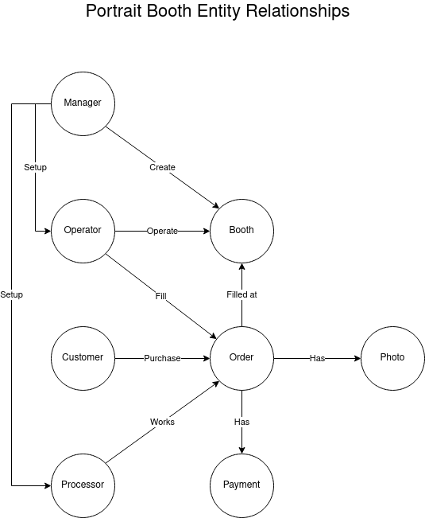

# Entities

1. User: Customer
2. User: Operator
3. User: Processor
4. User: Manager
5. Booth
6. Order
7. Photo: Original
8. Photo: Processed
9. Photo: Thumbnail

# Properties

## User

1. Name
2. Email
3. Phone
4. Type
5. Roles - Manager, Operator, Processor, Customer

## Booth

1. Name
2. Current Operator
3. Status - Open, Closed

## Order

1. ID
2. Created At
3. Photo Count
4. Status - Created, Paid, Processed
5. Paid At
6. Processed At
7. Delivered At

## Photo

1. ID
2. File name
3. S3 Url

# Relationships

1. Customer purchases orders
2. Operator operates booth
3. Operator fills orders
4. Processor works orders
5. Order has Photo
6. Order filled at booth

# API

## Booths

1. GET /api/booths
2. POST /api/booths
3. GET /api/booths/:booth
4. PUT /api/booths/:booth
5. PATCH /api/booths/:booth
6. DELETE /api/booths/:booth

## Users

1. GET /api/users
2. POST /api/users
3. GET /api/users/:user
4. PUT /api/users/:user
5. PATCH /api/users/:user
6. DELETE /api/users/:user

## Orders

1. GET /api/orders
2. POST /api/orders
3. GET /api/orders/:order
4. PUT /api/orders/:order
5. PATCH /api/orders/:order
6. DELETE /api/orders/:order

## Photos

1. GET /api/photos
2. POST /api/photos
3. GET /api/photos/:photo
4. DELETE /api/photos/:photo
